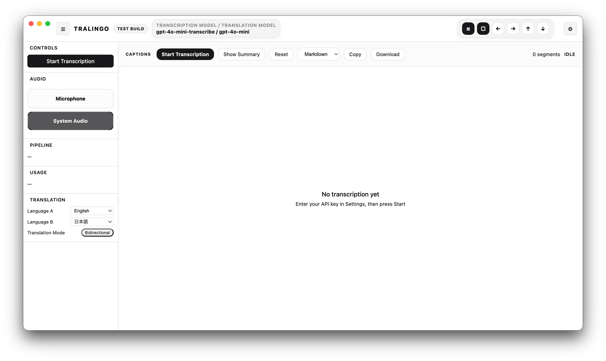
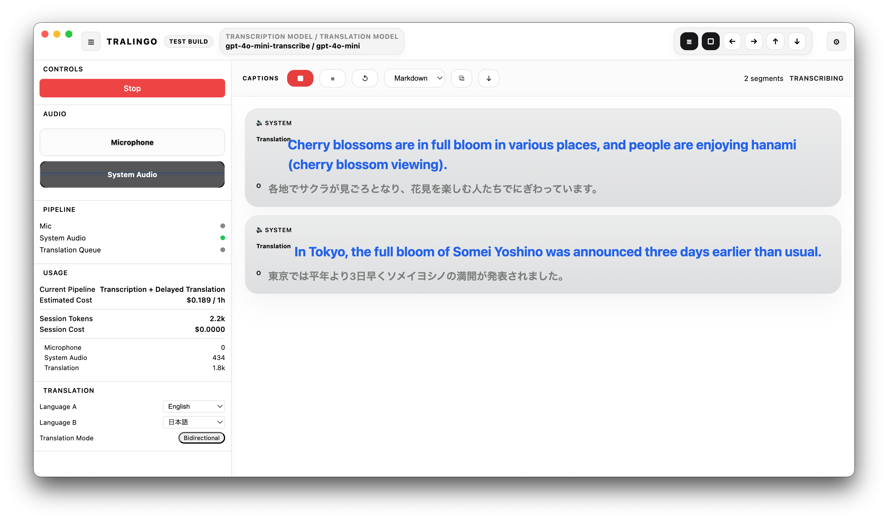
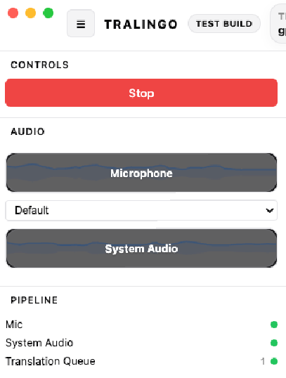

# TraLingo

Current public release: <!-- release-version:start -->v0.1.7<!-- release-version:end -->

[English](#english) | [日本語](#日本語) | [한국어](#한국어) | [简体中文](#简体中文)

## English

TraLingo is a macOS app for realtime transcription, translation, summaries, and export.

The app itself is free.  
OpenAI and DeepL usage is billed separately, and you need to bring your own API keys.

### What you can do

- Follow live speech in text while people are still talking
- Keep the original line and the translated line on screen together
- Use microphone input, system audio, or both
- Switch between delayed translation and realtime translation
- Create a summary from the captions already on screen
- Copy or download the result as text or Markdown

### Screens

#### Home

#### Live transcription and translation

#### Audio activity

### Download

- [GitHub Releases](https://github.com/nococoanolife/TraLingo/releases/latest)  
  Download the newest `TraLingo.dmg`.
- [Project site](https://nococoanolife.github.io/TraLingo/)  
  Read features, setup steps, and privacy details.

### API keys you need

#### OpenAI API key

- Required for OpenAI-based transcription and translation
- OpenAI API is paid
- You usually need to set up billing first
- Links:
  - [API keys](https://platform.openai.com/settings/organization/api-keys)
  - [Billing](https://platform.openai.com/settings/organization/billing/overview)
  - [Usage](https://platform.openai.com/usage)

#### OpenAI Admin key

- Optional
- Only needed for budget or admin-oriented views
- Link:
  - [Admin keys](https://platform.openai.com/settings/organization/admin-keys)

#### DeepL API key

- Optional
- Needed only if you choose DeepL as the translation provider
- Links:
  - [DeepL keys](https://www.deepl.com/en/your-account/keys)
  - [DeepL API pricing](https://www.deepl.com/pro-api)

### Need help?

- [Issues](https://github.com/nococoanolife/TraLingo/issues)  
  Bug reports, crashes, translation problems, and concrete feature requests
- [Discussions](https://github.com/nococoanolife/TraLingo/discussions)  
  Questions, ideas, usage stories, and general feedback

### Privacy and transport

- OpenAI Realtime uses WebSocket to `wss://api.openai.com/v1/realtime`
- DeepL uses HTTPS API requests
- Both are protected in transit by TLS
- If you enable OpenAI or DeepL, the relevant audio or text is sent to that provider
- Audio files are not saved automatically during normal use

See the [privacy page](https://nococoanolife.github.io/TraLingo/privacy.html) for details.

## 日本語

TraLingo は、macOS 向けのリアルタイム文字起こし・翻訳アプリです。

アプリ本体は無料です。  
ただし OpenAI や DeepL の API 利用料は別途かかり、API キーは自分で用意する必要があります。

### できること

- 話している内容を、その場で文字で追える
- 原文と翻訳を同じ画面で確認できる
- マイク音声とシステム音声を分けて扱える
- 遅延翻訳とリアルタイム翻訳を切り替えられる
- 画面に出ている字幕からそのままサマリーを作れる
- テキストや Markdown として持ち帰れる

### 画面イメージ

#### ホーム画面

#### 文字起こしと翻訳

#### 音声入力の確認

### ダウンロード

- [最新リリース](https://github.com/nococoanolife/TraLingo/releases/latest)  
  最新の `TraLingo.dmg` をダウンロードできます。
- [プロジェクトサイト](https://nococoanolife.github.io/TraLingo/)  
  機能、使い方、プライバシー情報を確認できます。

### 必要な API キー

#### OpenAI API キー

- OpenAI を使った文字起こしと翻訳に必要です
- OpenAI API は有料です
- 先に Billing を設定しないと使えないことがあります
- 関連ページ:
  - [API Keys](https://platform.openai.com/settings/organization/api-keys)
  - [Billing](https://platform.openai.com/settings/organization/billing/overview)
  - [Usage](https://platform.openai.com/usage)

#### OpenAI Admin キー

- 通常は不要です
- 予算や管理系の情報を見たい時だけ使います
- 関連ページ:
  - [Admin Keys](https://platform.openai.com/settings/organization/admin-keys)

#### DeepL API キー

- DeepL を翻訳エンジンとして使う時だけ必要です
- 関連ページ:
  - [DeepL API Keys](https://www.deepl.com/en/your-account/keys)
  - [DeepL API Pricing](https://www.deepl.com/pro-api)

### 困った時

- [Issues](https://github.com/nococoanolife/TraLingo/issues)  
  不具合、クラッシュ、翻訳ミス、実装レベルの要望
- [Discussions](https://github.com/nococoanolife/TraLingo/discussions)  
  使い方の相談、アイデア共有、雑談ベースのフィードバック

### プライバシーと通信

- OpenAI のリアルタイム文字起こしは `wss://api.openai.com/v1/realtime` への WebSocket を使います
- DeepL は HTTPS API を使います
- どちらも通信中は TLS で保護されます
- OpenAI / DeepL を使う設定では、必要な音声やテキストはその provider に送信されます
- 通常利用では音声ファイルを自動保存しません

詳しくは [プライバシーポリシー](https://nococoanolife.github.io/TraLingo/privacy.html) を確認してください。

## 한국어

TraLingo는 macOS용 실시간 전사·번역 앱입니다.

앱 자체는 무료입니다.  
다만 OpenAI나 DeepL API 사용료는 별도이며, API 키는 직접 준비해야 합니다.

### 할 수 있는 일

- 말하는 내용을 바로 자막처럼 따라가기
- 원문과 번역문을 같은 화면에서 확인하기
- 마이크와 시스템 오디오를 따로 다루기
- 지연 번역과 실시간 번역을 전환하기
- 현재 화면의 자막으로 바로 요약 만들기
- 텍스트나 Markdown으로 내보내기

### 화면 예시

#### 홈 화면

#### 실시간 전사와 번역

#### 오디오 입력 확인

### 다운로드

- [최신 릴리스](https://github.com/nococoanolife/TraLingo/releases/latest)  
  최신 `TraLingo.dmg` 를 받을 수 있습니다.
- [프로젝트 사이트](https://nococoanolife.github.io/TraLingo/)  
  기능, 사용 방법, 개인정보 처리 안내를 볼 수 있습니다.

### 필요한 API 키

#### OpenAI API 키

- OpenAI 기반 전사와 번역에 필요합니다
- OpenAI API는 유료입니다
- 먼저 Billing 설정이 필요할 수 있습니다
- 링크:
  - [API Keys](https://platform.openai.com/settings/organization/api-keys)
  - [Billing](https://platform.openai.com/settings/organization/billing/overview)
  - [Usage](https://platform.openai.com/usage)

#### OpenAI Admin 키

- 보통은 필요 없습니다
- 예산이나 관리 화면을 볼 때만 사용합니다
- 링크:
  - [Admin Keys](https://platform.openai.com/settings/organization/admin-keys)

#### DeepL API 키

- DeepL 번역을 쓸 때만 필요합니다
- 링크:
  - [DeepL API Keys](https://www.deepl.com/en/your-account/keys)
  - [DeepL API Pricing](https://www.deepl.com/pro-api)

### 도움이 필요할 때

- [Issues](https://github.com/nococoanolife/TraLingo/issues)  
  버그, 크래시, 번역 문제, 구체적인 개선 요청
- [Discussions](https://github.com/nococoanolife/TraLingo/discussions)  
  사용법 질문, 아이디어 공유, 일반 피드백

## 简体中文

TraLingo 是一款面向 macOS 的实时转录与翻译应用。

应用本身免费。  
但 OpenAI 或 DeepL 的 API 调用费用需要另外承担，API 密钥也需要自己准备。

### 可以做什么

- 一边听一边看实时字幕
- 在同一画面查看原文和译文
- 分别处理麦克风和系统音频
- 在延迟翻译和实时翻译之间切换
- 直接根据当前字幕生成摘要
- 导出为文本或 Markdown

### 画面示例

#### 首页

#### 转录与翻译

#### 音频输入确认

### 下载

- [最新版本](https://github.com/nococoanolife/TraLingo/releases/latest)  
  可以下载最新的 `TraLingo.dmg`。
- [项目网站](https://nococoanolife.github.io/TraLingo/)  
  可以查看功能介绍、使用说明和隐私说明。

### 需要的 API 密钥

#### OpenAI API 密钥

- OpenAI 转录和翻译需要这个密钥
- OpenAI API 是付费服务
- 通常需要先完成 Billing 设置
- 链接：
  - [API Keys](https://platform.openai.com/settings/organization/api-keys)
  - [Billing](https://platform.openai.com/settings/organization/billing/overview)
  - [Usage](https://platform.openai.com/usage)

#### OpenAI Admin 密钥

- 通常不需要
- 只有在查看预算或管理信息时才会用到
- 链接：
  - [Admin Keys](https://platform.openai.com/settings/organization/admin-keys)

#### DeepL API 密钥

- 只有在你选择 DeepL 作为翻译服务时才需要
- 链接：
  - [DeepL API Keys](https://www.deepl.com/en/your-account/keys)
  - [DeepL API Pricing](https://www.deepl.com/pro-api)

### 遇到问题时

- [Issues](https://github.com/nococoanolife/TraLingo/issues)  
  Bug、崩溃、翻译错误、明确的功能需求
- [Discussions](https://github.com/nococoanolife/TraLingo/discussions)  
  使用问题、想法交流、一般反馈
